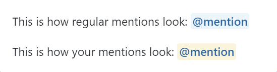
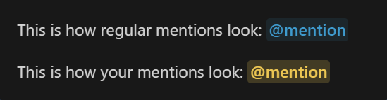

# GitHub Mention Highlighter

A UserCSS style to highlight @mentions on GitHub so they're easier to see.
Mentions are highlighted in blue and there's a optional configurable style for mentions of yourself which are yellow.

There are two versions of this style, one for GitHub's default style, and one for users of [GitHub Dark](https://github.com/StylishThemes/GitHub-Dark).

## Preview

Default | GitHub Dark
-- | --
 | 
